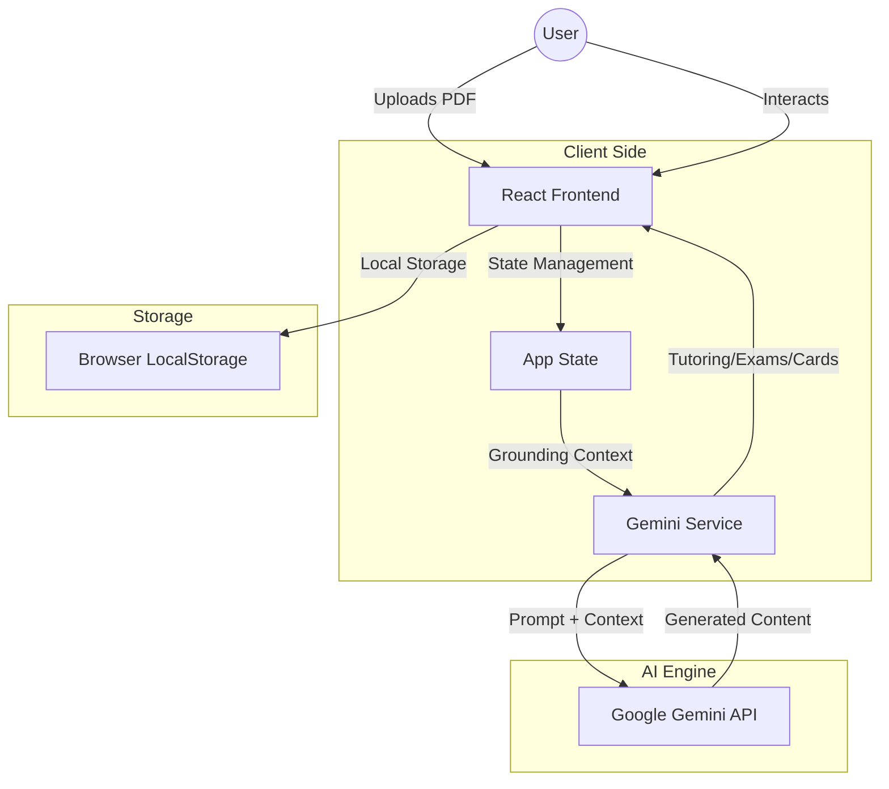

# Khula Tutor - AI Academic Companion

Khula Tutor is an immersive AI-powered tutoring platform designed to structure knowledge from your own documents. It provides personalized, syllabus-aligned learning experiences through live AI avatars, interactive exam simulations, and adaptive study tools.


## 🚀 High-Level Overview

Khula Tutor transforms static study materials (PDFs) into dynamic learning environments. By grounding the Gemini AI in your specific documents, the platform ensures that tutoring sessions, exam questions, and flashcards are strictly relevant to your curriculum.

### Key Features
- **Intelligence Hub:** Upload and manage your study materials.
- **Tutoring Room:** Engage in real-time conversations with an AI avatar grounded in your documents.
- **Exam Center:** Simulate high-pressure exams with questions derived from your materials.
- **Study Cards:** Automatically generated flashcards based on identified knowledge gaps.
- **Growth Tracking:** Visualize your learning progress and syllabus coverage.

---

## 🏗️ Architecture Diagram

The following diagram illustrates the high-level architecture of the Khula Tutor platform.



---

## 🧪 Reproducible Testing Instructions

To verify the functionality of Khula Tutor, follow these steps:

### 1. Prerequisites
- Node.js (v18 or higher)
- A Google Gemini API Key

### 2. Setup
1. Clone the repository:
   ```bash
   git clone https://github.com/dubejabulani16/khula-tutor.git
   cd khula-tutor
   ```
2. Install dependencies:
   ```bash
   npm install
   ```
3. Configure environment variables:
   Create a `.env` file in the root directory and add your API key:
   ```env
   GEMINI_API_KEY=your_actual_api_key_here
   ```

### 3. Running the App
1. Start the development server:
   ```bash
   npm run dev
   ```
2. Open your browser to `http://localhost:3000`.

### 4. Test Scenarios
- **Scenario A: Document Grounding**
  1. Navigate to the **Intelligence Hub**.
  2. Upload a sample PDF (e.g., a biology chapter).
  3. Verify the document appears in the library.
- **Scenario B: AI Tutoring**
  1. Navigate to the **Tutoring Room**.
  2. Ask a question specific to the uploaded PDF.
  3. Verify the AI responds using information from the document.
- **Scenario C: Exam Generation**
  1. Navigate to the **Exam Center**.
  2. Start a new exam.
  3. Verify questions are relevant to your uploaded material.

---

## 🌐 Public Code Repo

[](https://github.com/dubejabulani16/khula-tutor)

The source code for this project is hosted on GitHub:
[https://github.com/dubejabulani16/khula-tutor](https://github.com/dubejabulani16/khula-tutor)

---

## ☁️ Proof of Google Cloud Deployment

Khula Tutor is deployed and running on **Google Cloud Run**.

**Live Application URL:** [https://ais-dev-geh2mj74yamhjkadurw3c5-61460379161.europe-west1.run.app](https://ais-dev-geh2mj74yamhjkadurw3c5-61460379161.europe-west1.run.app)

### Deployment Details
- **Platform:** Google Cloud Run
- **Region:** europe-west1
- **CI/CD:** Automated via Google AI Studio Build
- **Containerization:** Docker-based deployment


---

## 📸 Screenshots

### Intelligence Hub

*Manage your syllabus and research papers with ease.*

### AI Tutoring Room

*Real-time interactive sessions with your academic avatar.*

### Growth Tracking

*Visualize your academic progress and syllabus coverage.*

---

## 🛠️ Tech Stack
- **Frontend:** React 19, TypeScript, Tailwind CSS
- **AI:** Google Gemini API (@google/genai)
- **Icons:** Lucide React (via UI_ICONS constants)
- **Build Tool:** Vite
