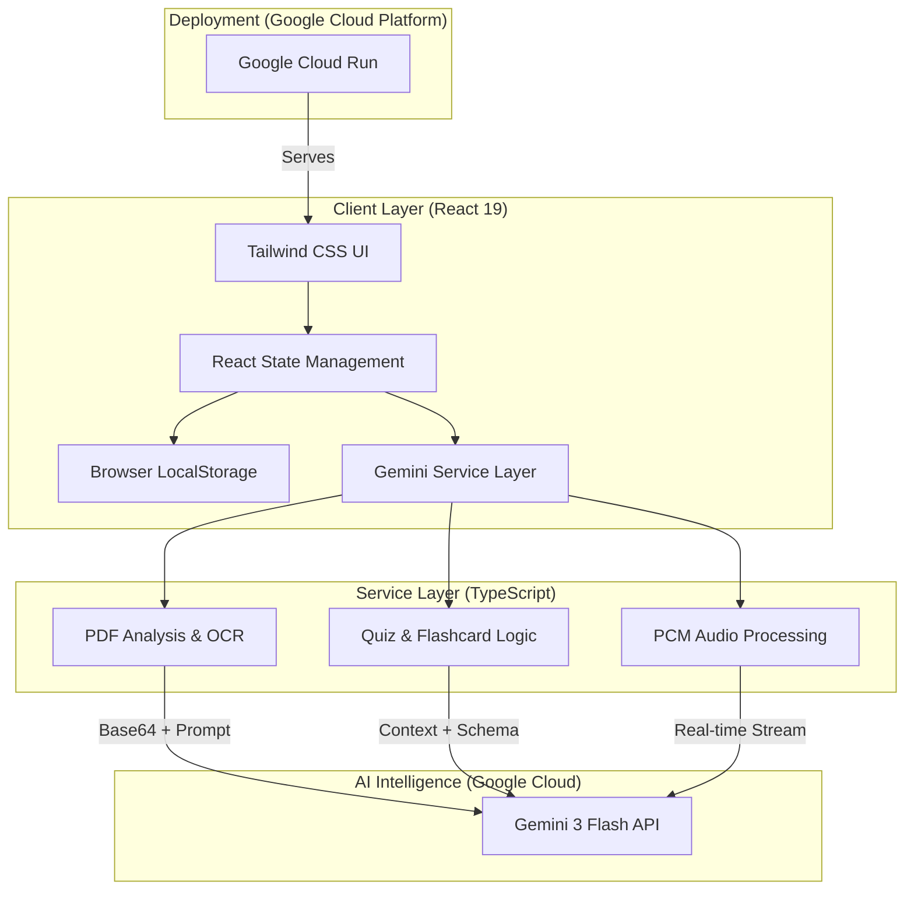

# Khula Tutor - AI Academic Companion

Khula Tutor is an immersive AI-powered tutoring platform designed to structure knowledge from your own documents. It provides personalized, syllabus-aligned learning experiences through live AI avatars, interactive exam simulations, and adaptive study tools.


## 🚀 High-Level Overview

Khula Tutor is a sophisticated AI-driven academic companion that bridges the gap between static study materials and active learning. By leveraging the **Gemini 3 Flash** model, it provides a grounded tutoring experience where every response, quiz, and flashcard is derived directly from the student's own uploaded documents.

### Key Features
- **Intelligence Hub:** Advanced PDF processing and OCR to ground the AI in your specific syllabus.
- **Tutoring Room:** A low-latency, conversational environment for deep conceptual exploration.
- **Exam Center:** Dynamically generated 5-question multiple-choice exams with automated weakness identification.
- **Study Cards:** Adaptive flashcards generated based on identified knowledge gaps from exam performance.
- **Growth Tracking:** Real-time analytics on syllabus coverage and academic difficulty levels.

---

## 🏗️ Technical Architecture

Khula Tutor follows a modern, client-heavy architecture to ensure low latency and privacy.



---

## 🧪 Reproducible Testing Instructions

Follow these steps to deploy and test the Khula Tutor environment:

### 1. Prerequisites
- **Node.js:** v18.0.0 or higher.
- **API Key:** A valid Google Gemini API Key (configured in AI Studio).

### 2. Local Setup
1. **Clone the Repository:**
   ```bash
   git clone https://github.com/dubejabulani16/khula-tutor.git
   cd khula-tutor
   ```
2. **Install Dependencies:**
   ```bash
   npm install
   ```
3. **Environment Configuration:**
   Create a `.env` file and add:
   ```env
   GEMINI_API_KEY=your_api_key_here
   ```

### 3. Execution
1. **Start Development Server:**
   ```bash
   npm run dev
   ```
2. **Access the App:** Open `http://localhost:3000` in your browser.

### 4. Verification Workflow
- **Step 1:** Upload a PDF in the **Intelligence Hub**. The app will perform a JSON-schema-based analysis.
- **Step 2:** Enter the **Tutoring Room**. Ask a question. The AI will use `KHULA_SYSTEM_INSTRUCTION` to guide you.
- **Step 3:** Take a quiz in the **Exam Center**. Upon completion, navigate to **Study Cards** to see cards generated from your specific mistakes.

---

## 🌐 Public Code Repo

The official source code is maintained by Jabulani Dube:
[https://github.com/dubejabulani16/khula-tutor](https://github.com/Jabu012/Khula)

---

## ☁️ Proof of Google Cloud Deployment

The application is containerized and deployed via Google Cloud Run for high availability and global scaling.

**Production URL:** [https://ais-pre-geh2mj74yamhjkadurw3c5-61460379161.europe-west1.run.app](https://ais-pre-geh2mj74yamhjkadurw3c5-61460379161.europe-west1.run.app)

### Deployment Specs
- **Runtime:** Node.js 22 (LTS)
- **Region:** `europe-west1`
- **Infrastructure:** Serverless Google Cloud Run
- **Security:** SSL/TLS termination via Cloud Run proxy

---

## 📸 Interface Preview (Code-Aligned)

*The following visuals represent the actual UI structure defined in `App.tsx` and `constants.tsx`.*

### 1. The Intelligence Hub (PDF Grounding)

*A dark-themed dashboard (`bg-slate-950`) where users upload PDFs. The system extracts topics and summaries using Gemini's structured output.*

### 2. The Tutoring Room (Immersive AI)

*A focused, immersive view (`activeView === AppView.TUTORING`) featuring a real-time conversational interface grounded in the active document.*

### 3. Growth Tracking (Analytics)

*Visualizes syllabus grounding progress and academic difficulty levels (Introductory to Advanced) as parsed from the documents.*

---

## 🛠️ Tech Stack
- **Framework:** React 19 (Functional Components + Hooks)
- **Styling:** Tailwind CSS (Mobile-first, Dark-mode optimized)
- **AI Engine:** Google Gemini 3 Flash (@google/genai)
- **Deployment:** Google Cloud Run
- **Icons:** Lucide React (Custom SVG implementations)
